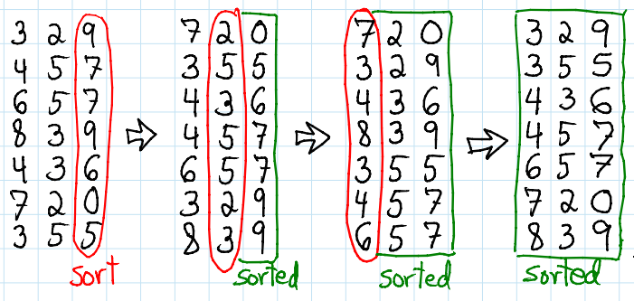
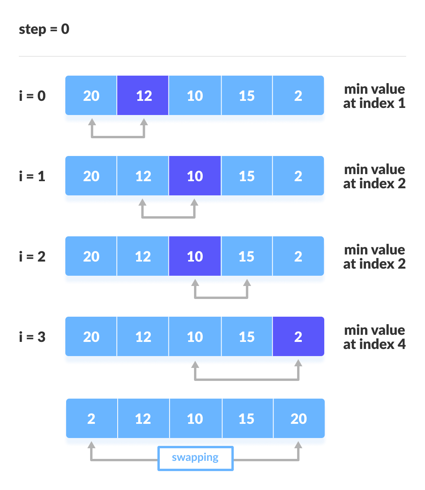
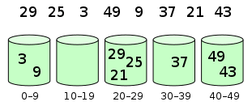

# Sorting Algorithm Analysis

Pada kesempatan kali ini kami akan menganalisis kompleksitas algoritma dari *4 jenis algoritma sorting*, yaitu:
- Redix Sort
- Bubble Sort
- Insertion Sort
- Selection Sort

## Radix Sort Algorithm



Radix Sorting adalah metode sorting yang ajaib yang mana mengatur pengurutan nilai tanpa melakukan beberapa perbandingan pada data yang dimasukkan. Secara harfiah, radix dapat diartikan sebagai posisi dalam angka. Pada sistem desimal, radix adalah digit dalam angka desimal. Seperti contoh, angka “42” mempunyai 2 digit yaitu 4 dan 2. Radix Sort memperoleh namanya dari digit-digit tersebut, karena metode ini pertama kalinya mengurutkan nilai-nilai input berdasarkan radix pertamanya, lalu pengurutan dilakukan berdasarkan radix keduanya, begitu juga seterusnya.


Berikut merupakan analisis dari **Radix Sort Algorithm**
```bash
Deklarasi:
output[n]: integer;
count[10]: integer;
i: integer
exp: integer;
max: integer
Algoritma: 
max = arr[0];                                                            //1
i = 1;                                                                   //1
while(i < n) {                                                           //n
    if (arr[i] > max) {                                                  //n-1
        max = arr[i];                                                    //n-1
    }                                                                    
    i = i + 1;                                                           //2(n-1)
}
exp = 1                                                                  //1
while(max / exp > 0) {                                                   //n+1
    i = 0                                                                //n
    while(i < n) {                                                       //n(n+1)
        count[(arr[i] / exp) % 10] = count[(arr[i] / exp) % 10] + 1;     //n(6n)
        i = i + 1                                                        //n(2n)
    }
    i = 1                                                                //n
    while(i < 10) {                                                      //n(10)
        count[i] = count[i] + count[i - 1];                              //n(27)
        i = i + 1;                                                       //n(18)
    }
    i = n - 1;                                                           //2n                                                          
    while(i >= 0){                                                       //n(n+1)
        output[count[(arr[i] / exp) % 10] - 1] = arr[i];                 //n(4n)
        count[(arr[i] / exp) % 10] = count[(arr[i] / exp) % 10] - 1;     //n(6n)
        i = i - 1;                                                       //n(2n)
    }
    i = 0;                                                               //n
    while(i < n) {                                                       //n(n+1)
        arr[i] = output[i];                                              //n(n)
        i = i + 1                                                        //n(2n)
    }
    exp = exp * 10                                                       //2n
}
```
Dari perhitunga tersebut didapatkan:
```bash
T(n)    = 1 + 1 + n + n-1 + n-1 +2(n-1) + 1 + n+1 + n + n(n+1) + n(6n) + n(2n) + n + n(10) + n(27) + n(18) + 2n + n(n+1) + n(4n) + n(6n) + n(2n) + n + n(n+1) + n(n) + n(2n) + 2n
        = 26n^2 + 71n
O(n^2)
```
**Penjelasan untuk 'm'**

Pada Radix Sort Algorithm terdapat nilai max dimana digunakan untuk menghitung nilai terbesar. Nilai tersebut digunakan untuk melakukan perulangan sebanyak panjang bilangan. Sebagai contoh misalkan nilai terbesar dari suatu himpunan bilangan 1867, maka m = 4 dan akan melakukan perulangan sebanyak 4 kali pada baris 28 s/d 51. Jika nilai terbesar 75, maka akan melakukan perulangan sebanyak 2 kali.

## Bubble Sort Algorithm


Berikut merupakan analisis dari **Bubble Sort Algorithm**
```bash
Deklarasi:
temp: integer;
swapped: boolean;
Algoritma:
int i = 0                            //1
while(i < n - 1){                    //2n
    swapped = false;                 //n-1
    int j = 0                        //n-1
    while(j < n - i - 1){            //3(n(n)/2)
        if (arr[j] > arr[j + 1]) {   //2(n(n-1)/2)
            temp = arr[j];           //1(n(n-1)/2)
            arr[j] = arr[j + 1];     //2(n(n-1)/2)
            arr[j + 1] = temp;       //2(n(n-1)/2)
            swapped = true;          //n(n-1)/2
        }
        j = j + 1;                   //2(n(n-1)/2)
    }
    if (!swapped){                   //n-1
        break;                       //n-1
    }
    i = i + 1;                       //2(n-1)
}
```
Dari perhitunga tersebut didapatkan:
```bash
T(n)    = 1 + 2n + n-1 + n-1 + 3(n(n)/2) + 2(n(n-1)/2) + 1(n(n-1)/2) + 2(n(n-1)/2) + 2(n(n-1)/2) + n(n-1)/2 + 2(n(n-1)/2) + n-1 + n-1 + 2(n-1)
        = (13n^2 + 6n - 10)/2
O(n^2)
```
**Penjelasan untuk perulangan kedua**

Pada perulangan kedua sudah pasti jumlah perulangan dimulai dengan n-1 kemudian n-2 kemudian n-3 sampai hanya 1 kali perulangan sehingga di dapat perulangan tersebut membentuk pola aritmatika dengan bilangan pertama didapatkan n-1 dan beda -1
```bash
a   = n-1
b   = -1
Un  = a + (n-1)b
    = n-1 + (n-1)*(-1)
    = n-1 + (-n+1)
    = 0
Sn  = n/2(a + Un)
    = n/2(n-1 + 0)
    = n(n-1)/2
```

## Insertion Sort


Berikut merupakan analisis dari **Insertion Sort Algorithm**
```bash
Deklarasi:
i: integer
j: integer
key: integer
Algoritma:
i = 1;                                //1
while(i < n) {                        //n
    key = arr[i];                     //n-1
    j = i - 1;                        //2(n-1)
    while (j >= 0 && arr[j] > key){   //n(n+3)/2
        arr[j + 1] = arr[j];          //2(n(n+1)/2)
        j = j - 1;                    //2(n(n+1)/2)
    }
    arr[j + 1] = key;                 //n-1
    i = i + 1;                        //2(n-1)
}
```
Dari perhitunga tersebut didapatkan:
```bash
T(n)    = 1 + n + n-1 + 2(n-1) + n(n+3)/2 + 2(n(n+1)/2) + 2(n(n+1)/2) + n-1 + 2(n-1)
        = (5n^2 + 21n - 10)/2
O(n^2)
```
**Penjelasan untuk perulangan kedua**

Pada perulangan kedua sudah pasti jumlah perulangan dimulai dengan 1 kali perulangan kemudian 2 kali kemudian 3 kali sampai hanya n-1 kali perulangan sehingga di dapat perulangan tersebut membentuk pola aritmatika dengan bilangan pertama didapatkan 1 dan beda 1
```bash
a   = 1
b   = 1
Un  = a + (n-1)b
    = 1 + (n-1)1
    = n
Sn  = n/2(a + Un)
    = n/2(1 + n)
    = n(n+1)/2
```

## Selection Sort



Berikut merupakan analisis dari Selection Sort Algorithm
```bash
Deklarasi:
i: integer
j: integer
minIndex: integer
temp: integer
Algoritma:
i = 0;                                    //1
while(i < n - 1) {                        //n
    minIndex = i;                         //n-1
    j = i + 1;                            //2(n-1)
    while(j < n) {                        //n(n)/2
        if (arr[j] < arr[minIndex]) {     //n(n-1)/2
            minIndex = j;                 //n(n-1)/2
        }
        j = j + 1;                        //2(n(n-1)/2)    
    }
    temp = arr[minIndex];                 //n-1
    arr[minIndex] = arr[i];               //n-1
    arr[i] = temp;                        //n-1
    i = i + 1;                            //2(n-1)
}
```
Dari perhitunga tersebut didapatkan:
```bash
T(n)    = 1 + n + n-1 + 2(n-1) + n(n)/2 + n(n-1)/2 + n(n-1)/2 + 2(n(n-1)/2) + n-1 + n-1 + n-1 + 2(n-1)
        = (5n^2 + 14n - 14)/2
O(n^2)
```
**Penjelasan untuk perulangan kedua**

Pada perulangan kedua sudah pasti jumlah perulangan dimulai dengan n-1 kemudian n-2 kemudian n-3 sampai hanya 1 kali perulangan sehingga di dapat perulangan tersebut membentuk pola aritmatika dengan bilangan pertama didapatkan n-1 dan beda -1
```bash
a   = n-1
b   = -1
Un  = a + (n-1)b
    = n-1 + (n-1)*(-1)
    = n-1 + (-n+1)
    = 0
Sn  = n/2(a + Un)
    = n/2(n-1 + 0)
    = n(n-1)/2
```

## Bucket Sort Algorithm



```bash
Deklarasi:
i: integer
j: integer
bi: integer
index: integer

Algoritma:
vector<float> b[n];                        //1
i = 0;                                     //1
while (i < n) {                            //n+1
    bi = n * arr[i];                       //2n
    b[bi].push_back(arr[i]);               //n
    i = i + 1;                             //2n
}
i = 0;                                     //1
while(i < n) {                             //n+1
    sort(b[i].begin(), b[i].end());        //n
	index = 0;                             //n
    i = i + 1;                             //2n
}
i = 0;                                     //1
while(i < n)                               //n+1
    j = 0                                  //n
    while(j < b[i].size())                 //n(n)
        arr[index++] = b[i][j];            //n(3n)
        j = j + 1;                         //n(2n)
    }
    i = 1 + 1                              //2n
}
```
Dari perhitunga tersebut didapatkan:
```bash
T(n)    = 1 + 1 + n+1 + 2n + 2n + n + 2n + 1 + n+1 + n + n + 2n + 1 + n+1 + n + n(n) + n(3n) + n(2n) + 2n
        = 6n^2 + 17n + 7
O(n^2)
```
